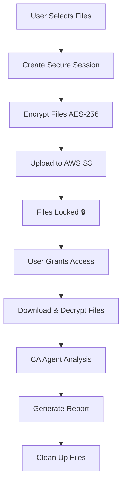

# FinAI - Secure Financial Document Analysis 🔒

An AI-powered Chartered Accountant system with end-to-end encryption for secure financial document analysis.

## 🌟 Key Features

### 🔐 Security First
- **AES-256-CBC Encryption**: Files encrypted before upload
- **AWS S3 Secure Storage**: Enterprise-grade cloud storage
- **Grant Access Flow**: Explicit user consent required
- **Session Management**: Secure token-based access
- **Auto Cleanup**: Files automatically deleted after processing
- **Zero-Knowledge Architecture**: Server cannot access files without permission

### 🤖 AI Analysis
- **Multi-Document Support**: PDF, JPG, PNG formats
- **Occupation-Specific Analysis**: Salaried, Self-Employed, Business
- **Intelligent Processing**: CrewAI-powered document understanding
- **Comprehensive Reports**: Detailed financial analysis and recommendations

### 💰 Cost Optimized
- **AWS Free Tier Compatible**: Optimized for free tier usage
- **Efficient Storage**: 30-day automatic cleanup
- **Regional Optimization**: us-east-1 for best free tier benefits

## 🚀 Quick Start

### Prerequisites
- Python 3.8+
- Node.js 16+
- AWS Account (Free Tier)
- Cerebras API Key

### One-Click Setup (Windows)
```powershell
# Run the setup script
.\setup.ps1
```

### Manual Setup

1. **Clone and Setup**
   ```bash
   git clone <repository-url>
   cd finai-wemakedevs
   ```

2. **Backend Setup**
   ```bash
   cd ca_agent
   pip install -r requirements.txt
   copy .env.example .env
   # Edit .env with your credentials
   uvicorn app:app --reload --host 127.0.0.1 --port 8000
   ```

3. **Frontend Setup**
   ```bash
   cd ca-frontend
   npm install
   npm run dev
   ```

4. **Test Security Components**
   ```bash
   python test_security.py
   ```

## 🔧 Configuration

### Environment Variables (.env)
```env
# AWS Configuration (Required)
AWS_ACCESS_KEY_ID=your_aws_access_key
AWS_SECRET_ACCESS_KEY=your_aws_secret_key
AWS_REGION=us-east-1
AWS_S3_BUCKET_NAME=finai-encrypted-documents

# API Keys
CEREBRAS_API_KEY=your_cerebras_api_key

# Security Settings
ENCRYPTION_PASSWORD_LENGTH=32
SESSION_TIMEOUT_HOURS=2
MAX_FILE_SIZE_MB=10
```

## 🔄 Secure Upload Flow



## 📡 API Endpoints

### Secure Flow
- `POST /create-session` - Create upload session
- `POST /upload-secure` - Upload encrypted files
- `POST /grant-access` - Grant access to files
- `POST /analyze-secure` - Analyze documents securely

### Utility
- `GET /health` - System health check
- `GET /session/{id}/status` - Session status
- `POST /cleanup-expired-sessions` - Clean expired sessions

## 🎯 Usage

### 1. Select Occupation Type
Choose from:
- 👔 **Salaried**: W-2, pay stubs, tax documents
- 💼 **Self-Employed**: 1099s, business expenses, invoices
- 🏢 **Businessman**: Business financials, corporate documents

### 2. Choose Upload Mode
- 🔒 **Secure Upload** (Recommended): End-to-end encrypted
- ⚡ **Quick Upload** (Legacy): Direct upload for testing

### 3. Upload Documents
- Drag & drop or click to upload
- Supported: PDF, JPG, PNG (max 10MB each)
- Files automatically encrypted

### 4. Grant Access
- Click "Grant Access" to decrypt files
- Explicit consent required for processing

### 5. Get Analysis
- AI analyzes documents
- Comprehensive financial report generated
- Files automatically cleaned up

## 🔒 Security Architecture

### Encryption Details
- **Algorithm**: AES-256-CBC
- **Key Derivation**: PBKDF2-SHA256 (100,000 iterations)
- **Secure Random**: Cryptographically secure IV/salt generation
- **Memory Safe**: Secure key handling in memory

### Access Controls
- **Session Tokens**: Unique per upload session
- **Processing Keys**: Generated only after access grant
- **Time-Based Expiry**: 2-hour session timeout
- **Audit Trail**: All access attempts logged

### AWS S3 Security
- **Server-Side Encryption**: AES256
- **Lifecycle Policies**: 30-day automatic deletion
- **IAM Permissions**: Least privilege access
- **Regional Isolation**: Data stored in specified region

## 📊 Free Tier Optimization

### AWS Limits
- **Storage**: 5 GB free for 12 months
- **Requests**: 20K GET, 2K PUT per month
- **Transfer**: 15 GB out per month

### Optimization Features
- **Auto Cleanup**: Prevents storage accumulation
- **Efficient Uploads**: Single multipart upload
- **Compressed Storage**: Optimal file storage
- **Regional Selection**: us-east-1 for best pricing

## 🛠️ Development

### Project Structure
```
finai-wemakedevs/
├── ca_agent/                 # Backend (FastAPI)
│   ├── utils/
│   │   ├── encryption.py     # AES encryption
│   │   ├── s3_storage.py     # AWS S3 integration
│   │   └── session_manager.py # Session management
│   ├── app.py               # Main FastAPI app
│   └── requirements.txt     # Python dependencies
├── ca-frontend/             # Frontend (Next.js)
│   ├── components/
│   │   ├── SecureFileUpload.tsx # Secure upload component
│   │   └── FileUpload.tsx   # Legacy upload component
│   └── app/
├── test_security.py         # Security component tests
├── setup.ps1               # Windows setup script
└── SECURE_SETUP.md         # Detailed setup guide
```

### Testing
```bash
# Test encryption components
python test_security.py

# Test API endpoints
curl http://127.0.0.1:8000/health

# Frontend testing
cd ca-frontend
npm test
```

## 🔍 Troubleshooting

### Common Issues

**AWS S3 Connection Failed**
- Verify AWS credentials in `.env`
- Check IAM permissions
- Ensure bucket name is globally unique

**Encryption Errors**
- Install `cryptography` package: `pip install cryptography`
- Check Python version compatibility

**Session Expired**
- Sessions expire after 2 hours
- Create new session if expired

**Large File Upload Fails**
- Default limit: 10MB per file
- Adjust `MAX_FILE_SIZE_MB` in `.env`

## 📈 Monitoring

### Health Checks
- Backend: `http://127.0.0.1:8000/health`
- Session count: Available in health endpoint
- S3 connectivity: Tested in health check

### Logs
- Backend: Console output with structured logging
- Frontend: Browser console for errors
- AWS: CloudTrail for S3 access (if enabled)

## 🤝 Contributing

1. Fork the repository
2. Create feature branch: `git checkout -b feature/new-feature`
3. Commit changes: `git commit -am 'Add new feature'`
4. Push to branch: `git push origin feature/new-feature`
5. Create Pull Request

## 📄 License

This project is licensed under the MIT License - see the LICENSE file for details.

## 🆘 Support

- 📖 Documentation: `SECURE_SETUP.md`
- 🧪 Test Suite: `python test_security.py`
- 🔧 Health Check: `http://127.0.0.1:8000/health`
- 📊 API Docs: `http://127.0.0.1:8000/docs`

---

**⚠️ Important**: This system handles sensitive financial data. Always ensure compliance with local data protection regulations (GDPR, CCPA, etc.) and follow security best practices in production environments.